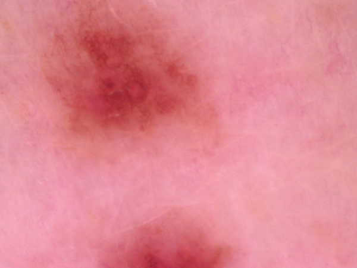
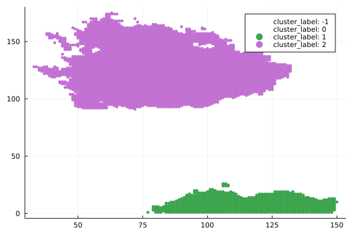
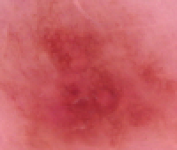

# NEVI - Skin Cancer detection and diagnosis system

Disclaimer!:
Skin cancer affects people of all skin tones but in this project we are focusing on the most endangered groups with lighter pigmentation coused by lack of data on the darker skin tones.

## Description

NEVI is a system for supporting medical diagnosis of various types of skin mutations/pathologies specialized for skin cancer detection. The system consists of two main parts:

1) Imgae processing

    Image processing consists of color-based clustering, distance clustering and the custom cropping mechanism.
    This part was written in Julia Programming Lenguage because of it's speed and elegancy.

2) Convolutional Neural Network

    The hearth of the system responsible for diagnosing the image with use of deep convolutional neural network created with fine tunning the Efficientnet V2 S.

All possibilities of the system is currently avaliable only as part of NEVI project.
In the future there is a plan to publish it as and fully functional API.

Usually the mutations of the skin occure in the sun-exposed areas of a human body.
These mutations are mainly caused by Ultra-violet light emmited by the sun which causes dameges of skin's DNA.
Not every skin mutation is cancerous, there are dermatological changes caused by simple DNA properties like moles or frecles.
This makes it harder for specialists to make life-saving decisions.
Another factor is the fact that non-cancerous changes can become cancerous over time.

The types of skin changes analysed in this thesis are:

    <strong>
        Non-cancerous
    </strong>

- Benign keratosis-like lesions 
- Melanocytic nevi
- Dermatofibroma
- Vascular lesions

    <strong>
        Cancerous
    </strong>

- Melanoma
- Basal cell carcinoma
- Actinic keratoses and intaepithelial carcinoma / Bowen's diesease

Description of carcerous mutations for educational purpouses:

<strong>
Melanoma
</strong>

- A large brownish spot with darker speckles
- A mole that changes in color, size or feel or that bleeds
- A small lesion with an irregular border and portions that appear red, pink, white, blue or blue-black
- A painful lesion that itches or burns
- Dark lesions on your palms, soles, fingertips or toes, or on mucous membranes lining your mouth, nose, vagina or anus

<strong>
Basal cell carcinoma
</strong>

- A pearly or waxy bump
- A flat, flesh-colored or brown scar-like lesion
- A bleeding or scabbing sore that heals and returns

<strong>
Bowen's diesease
</strong>

- A red or pink colors
- A scaly or crusty texture
- A flat or raised shape
- A size up to a few centimetres across
- Might feel itchy (but not all the time)

## Algorithmic pipline

Using unsupervised machine learning techniques algorithm is extracting the area of intrest to meaningfully support the neural network by decreasing dimentions of an image without losing crutial patterns and inforamtion embedded into the original image.

Step 1: 
Image input

Step 2: 
Color clustering done with custom implementation of Fuzzy C-Means

Step 3:
Distance clustering done with custom implementation of Density-Based Spatial Clustering for Application with Noise

Step 4: 
Cropping based on the previously deducted clusters
